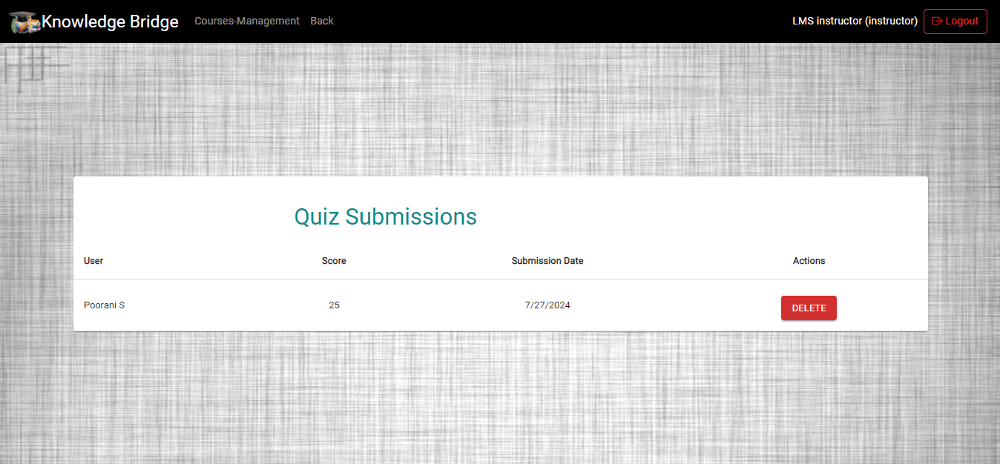

## Learning Management System (LMS)
The Learning Management System (LMS) is a comprehensive web application designed to facilitate online learning and course management. The platform supports various user roles, including admins, instructors, and students, providing tailored functionalities for each.

### Project Description
- This project aims to provide an all-in-one platform for online education, allowing users to manage courses, lessons, assignments, quizzes, and student progress. The LMS supports secure payment methods, and detailed tracking of academic progress.

## Admin Functionalities
### User Management

- Update & Delete User Details: Admins can manage user accounts by editing or deleting their details.
### Admin Login Details:
- Admin Email Id: admin@gmail.com
- Password: admin@2024

### Update User:

### Delete User:

- Update & Delete Student Enrollments: Admins can modify or remove student enrollments.
### Update Student Enrollments:

### Delete Student Enrollment:

### Course Management

- Create, Update & Delete Courses: Admins can manage courses, including creating new courses, updating existing ones, and deleting courses.
### Create Course:

### Update Course:

### Course Material
- Manage Lessons (Course Materials): Admins can create, update, and delete lessons within courses.
### Create Lesson:

### Update Lesson:

### Delete Lesson:

- View Lesson Completion: Admins can view details of students who have completed lessons.
### View Submission Student List:

### Assignment Management

- Create- Assignment, Delete-Assignment, Grade-Assignment Submissions & Delete-Assignment Submission: Admins can manage assignments, including grading student submissions.
### Assignment List Page:

### Assignment Submission List Page:

### Quiz Management

- Create, Delete, and Manage Quizzes: Admins can create and delete quizzes for each course.
### Quiz List Page:

Manage Quiz Submissions: Admins can view and delete quiz submissions from students.
### Quiz Submission List:

## Instructor Functionalities
### Admin Login Details:
- Instructor Email Id: instructor@gmail.com
- Password: Instructor@2024
### Course Material Management

- Create, Update & Delete Lessons: Instructors can manage course materials, including adding, editing, and deleting lessons.
View Lesson Completion: Instructors can view details of students who have completed lessons.
### Course Page: 

### Lesson Page

### Assignment Management

- Create, Update, Delete & Grade Submissions: Instructors can manage assignments and grade student submissions.
### Assignment List Page:

### Assignment Submission List Page:

### Quiz Management

- Create, Delete, and Manage Quizzes: Instructors can create and delete quizzes for each course.
### Quiz List Page:

- Manage Quiz Submissions: Instructors can view and delete quiz submissions from students.
### Quiz Submission List Page:

## Student Functionalities
### Course Enrollment

- Enroll in Courses: Students can enroll in courses using Stripe for payment or opt for the pay-later option.
### Course Enroll Page:

### Enroll Form Page

### payment Page:

### Dummy Card Details:
- Card No : 4242 4242 4242 4242
- MM/YY : 12/34
- CVC : 123
- ZIP : 12345
### Access Course Materials

- View Lessons: Students can easily access and study course materials provided in the lessons.
### Lesson Page:

### Assignment Submission

- Submit Assignments: Students can submit their assignments and view the grades and comments provided by admins and instructors.
## Assignment Page:

### Quiz Participation

- Take Quizzes: Students can participate in quizzes and receive immediate auto-graded scores.
### Quiz Page:

### Quiz Submission Page:

### Progress Tracking

- View Progress Report: Students can track their progress across courses, including completed lessons. 
### Progress Report

## User Functionalities
### Registration:
- User navigates to the registration page.
- User enters their firstname, lastname, email and password.
- Click on signup registration will be completed.
### Register Page:

### Login
- User navigates to the login page.
- User enters their email and password.
- Upon successful validation, user will be directed to homepage.
### Login Page

### Forgot Password:
- User clicks on the "Forgot Password" link.
- User enters their email.

### Forgot Password:

- Backend generates a password reset token and sends it to the user's email.
- User clicks on the link in the email to reset their password.
### Forgot Link Email:

- User enters a new password and confirms it.
- Backend updates the user's password.
## Tech Stack
- Frontend: React.js
- Backend: Node.js, Express.js
- Database: MongoDB
- Authentication: JWT, Bcrypt
- Payment Gateway: Stripe
- Styling: CSS (Bootstrap, Material UI & Antd for responsive design)
##
